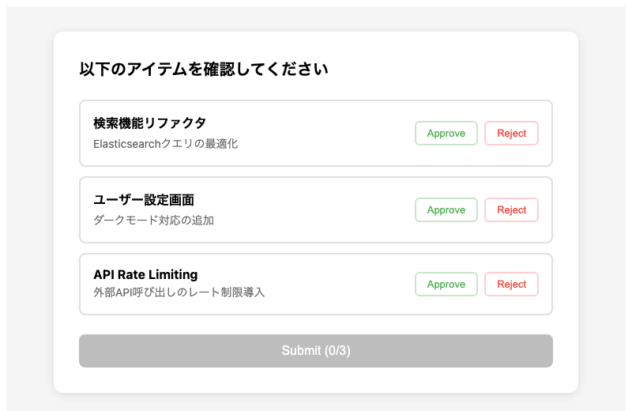
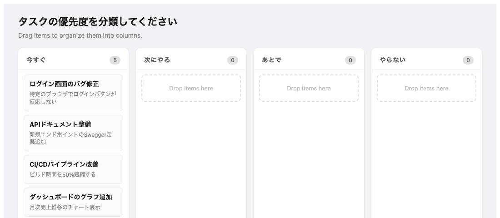
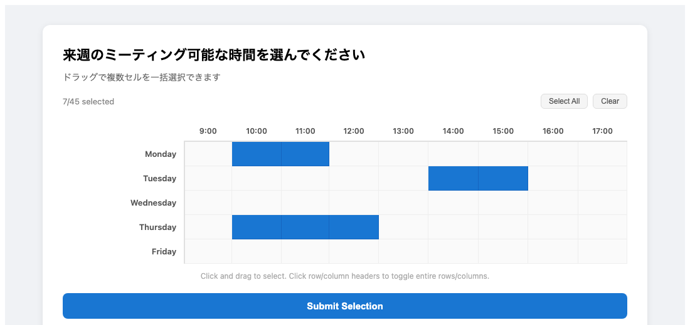
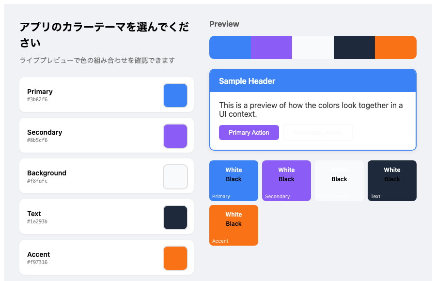

# Interactive Skill Test

> **Note:** このリポジトリは技術検証用です。現時点では特に実用的なものではありません。

AI エージェントのスキルとして動作するブラウザベースのインタラクティブ UI 集です。エージェントがユーザーから構造化された入力を受け取るために使用します。シェルコマンドの実行とブラウザの起動ができるエージェントであれば利用できます。

## How it works

各スキルは Node.js サーバー + React フロントエンドで構成されています。エージェントとユーザーの間をブラウザ UI が仲介し、構造化された入力を返します。

```
Agent                       Server                      Browser (User)
  │                           │                             │
  │  server.mjs --data '{}'   │                             │
  ├──────────────────────────►│  起動                       │
  │                           │                             │
  │  open http://localhost    │                             │
  ├───────────────────────────┼────────────────────────────►│
  │                           │                             │
  │                           │  GET /api/data              │
  │                           │◄────────────────────────────┤
  │                           │  初期データ返却             │
  │                           ├────────────────────────────►│
  │                           │                             │
  │                           │         ユーザーが UI 操作  │
  │                           │            ↕ ↕ ↕            │
  │                           │                             │
  │                           │  POST /api/respond          │
  │                           │◄────────────────────────────┤
  │  stdout に JSON 出力      │                             │
  │◄──────────────────────────┤  サーバー終了               │
  │                           │                             │
  │  結果を使って処理を継続   │                             │
  │                           │                             │
```

## Getting Started

```bash
npx skills add satetsu888/interactive-skill-test
```

インストール時にどのスキルを追加するか選択できます。特定のスキルだけを追加する場合:

```bash
npx skills add satetsu888/interactive-skill-test --skill demo-skill
npx skills add satetsu888/interactive-skill-test --skill kanban-sort
npx skills add satetsu888/interactive-skill-test --skill grid-selector
npx skills add satetsu888/interactive-skill-test --skill color-palette
```

アンインストール:

```bash
npx skills remove  # インタラクティブに選択して削除
```

## Skills

### Demo Skill - アイテム承認

アイテムの一覧を表示し、ユーザーに Approve / Reject を選択させます。



```bash
node skills/demo-skill/server.mjs --port 5190 --data '{
  "message": "以下のアイテムを確認してください",
  "items": [
    { "id": "1", "title": "検索機能リファクタ", "description": "Elasticsearchクエリの最適化" },
    { "id": "2", "title": "ユーザー設定画面", "description": "ダークモード対応の追加" }
  ]
}'
```

### Kanban Skill - ドラッグ&ドロップ分類

カンバンボード上でアイテムをカラム間にドラッグ&ドロップして分類します。



```bash
node skills/kanban-skill/server.mjs --port 5190 --data '{
  "title": "タスクの優先度を分類してください",
  "columns": ["今すぐ", "次にやる", "あとで"],
  "items": [
    { "id": "1", "title": "バグ修正", "description": "ログインボタンが反応しない" },
    { "id": "2", "title": "ドキュメント整備", "description": "Swagger定義追加" }
  ]
}'
```

### Grid Skill - グリッドセル選択

グリッド上でクリック&ドラッグしてセルを選択します。スケジュール調整や座席選択などに使えます。



```bash
node skills/grid-skill/server.mjs --port 5190 --data '{
  "title": "来週のミーティング可能な時間を選んでください",
  "rows": ["Monday", "Tuesday", "Wednesday", "Thursday", "Friday"],
  "columns": ["9:00", "10:00", "11:00", "12:00", "13:00", "14:00"],
  "preselected": ["Monday:10:00", "Monday:11:00"]
}'
```

### Color Skill - カラーパレット選択

カラーピッカーで色を選び、ライブプレビューで組み合わせを確認できます。



```bash
node skills/color-skill/server.mjs --port 5190 --data '{
  "title": "アプリのカラーテーマを選んでください",
  "slots": [
    { "label": "Primary", "defaultValue": "#3b82f6" },
    { "label": "Secondary", "defaultValue": "#8b5cf6" },
    { "label": "Accent", "defaultValue": "#f97316" }
  ]
}'
```

## Architecture

```
src/
├── demo/           # Demo Skill (Approve/Reject UI)
├── kanban/         # Kanban Skill (Drag & Drop board)
├── grid/           # Grid Skill (Cell selector)
├── color/          # Color Skill (Palette builder)
└── hooks/
    └── useAgentBridge.ts   # Server-Frontend bridge hook
skills/
├── demo-skill/     # Built output + server
├── kanban-skill/
├── grid-skill/
└── color-skill/
```

各スキルは共通の `useAgentBridge` フックを通じてサーバーと通信します:

1. `GET /api/data` でサーバーから初期データを取得
2. ユーザーが UI 上で操作
3. `POST /api/respond` で結果をサーバーに送信
4. サーバーが JSON を stdout に出力して終了

## Development

```bash
npm install
npm run build        # 全スキルをビルド
npm run build:demo   # 個別ビルド
```
